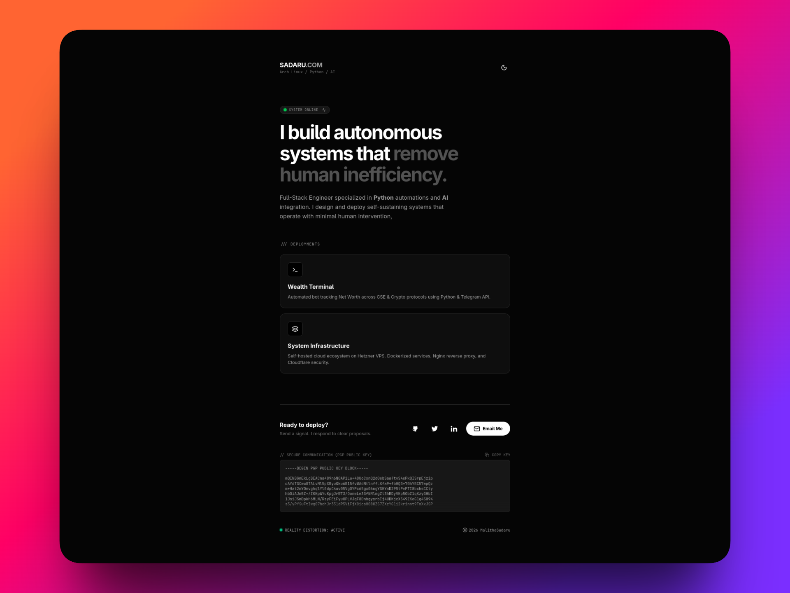
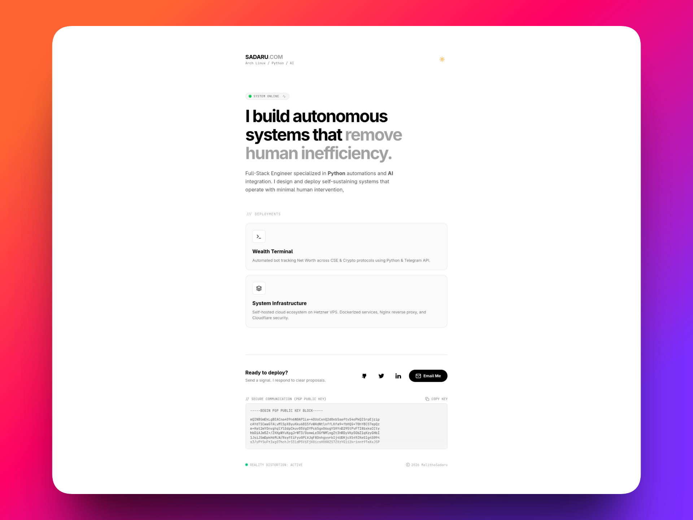

# sadaru-website-v2 





This is the personal portfolio and command center for **Malitha Sadaru**. Built to serve as a central node for my digital infrastructure, featuring real-time status monitoring, PGP-encrypted communication channels, and project tracking.

**Live Uplink:** [sadaru.com](https://sadaru.com)

---

## 🛠 Tech Stack (The Arsenal)

| Layer | Technology | Rationale |
| :--- | :--- | :--- |
| **Core** | `Next.js 16` | React Server Components & Bleeding Edge Performance |
| **Styling** | `Tailwind CSS v4` | Zero-runtime styling, rapid UI iteration |
| **Language** | `TypeScript` | Strict type safety for scalable architecture |
| **Runtime** | `Docker` | Containerized for immutable deployment |
| **Security** | `PGP` | Public key cryptography for secure contact |

---

## 🚀 Deployment Protocol

This system is designed to run in a **Dockerized** environment on a Linux VPS (Arch/Ubuntu).

### 1. The "Sovereign" Way (Docker)
We map the container's internal port (3000) to the host's exposed port (3003).

```bash
# 1. Build the image
docker build -t sadaru-website-v2 .

# 2. Run container (Mapped to Port 3003)
docker run -d \
  -p 3003:3000 \
  --name sadaru-v2 \
  --restart always \
  sadaru-website-v2

2. The "Local" Way (Dev Mode)
Bash

npm install
npm run dev
# Access at http://localhost:3000

🛡 Security Architecture

    Strict CSP: Content Security Policy headers enforced via next.config.ts.

    HSTS: Preload enabled for strict HTTPS transport.

    X-Frame: Clickjacking protection enabled.

    No-Leak: X-Powered-By headers stripped to obscure backend technology.


© 2026 Malitha Sadaru.
